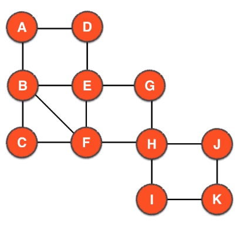
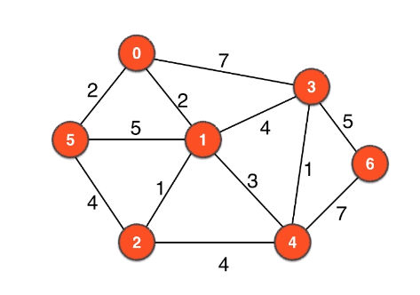

## 一、介绍

### 1.简介
Graph theory algorithm python implementation，which has the base class of the adjacency matrix of the graph and the ajdacency table,depth-first search (pre-order and post-order) and breadth-first search, in addition to the implementation of various application aspect of the graph ,Hamiltonian graph, directed graph Algorithm, the shortest path algorithm, Euler loop and Euler path, network flow, matching problem, etc. 

图论算法python实现，封装了图的邻接矩阵和邻接表的基础类，实现深度优先搜索（前序和后序）和广度优先搜索，图的各种应用方面的实现，哈密顿图，有向图算法，最短路径算法，欧拉回路和欧拉路径，网络流，匹配问题等等

主要是我最近在推荐算法或者nlp的时候，遇到有不懂的，借助bobo老师的课程系统学习了一下图论，并实现一下

### 2.环境

> python3

## 二、使用介绍

### 1. 图的表示和DFS

#### 1.1. 图的邻接矩阵使用
在AdjacencyMatrix类中

    加载g.txt，初始化图模型
    adjm = AdjList("../g.txt")
    获取图的信息
    adjm.get_graph_information()
    是否存在某条边
    print(adjm.hasEdge(0,4))
    求某个顶点的度
    print(adjm.degree(1))
    深度优先遍历(返回前序和后序遍历) PS：对于图来说无中序遍历，中序遍历只针对二叉树而言
    print(adjm.graphDFS())

#### 1.2. 图的邻接表使用
在AdjacencyList类中

    加载g.txt，初始化图模型
    adjl = AdjList("../g.txt")
    获取图的信息
    adjl.get_graph_information()
    是否存在某条边
    print(adjl.hasEdge(0,4))
    求某个顶点的度
    print(adjl.degree(1))
    深度优先遍历(返回前序和后序遍历) PS：对于图来说无中序遍历，中序遍历只针对二叉树而言
    print(adjl.graphDFS())

### 2. DFS的应用

#### 2.1 联通分量的个数
在一个社交网络的图模型中，求社交团体的个数相当于联通分量的个数
在CC类中    

    获取联通分量个数
    adjl.get_cccount()
    
#### 2.2 单源路径问题
两个顶点若均存在于某一个联通分量中，说明两点之间一定存在路径
在SingleSourcePath类中

    ssp = SingleSourcePath("../g_unconnected.txt", 0)
    ssp.get_graph_information()
    ssp.path(6)

提供第二种实现方法，丢弃负责记录访问顶点的记录的**visited**数组，只使用**pre**数组，节省空间，但相应地减少了代码的可读性

    ssp = SingleSourcePath_v2("../g_ssp.txt", 0)
    ssp.get_graph_information()
    ssp.path(6)
    ssp.path(5)

#### 2.3 无向图的环检测

判断是否有环：
1. 结点v已经访问过
2. 结点w能到结点v
3. 结点w的上一个结点parent不是v

        CD = CycleDetection("../g_cycle.txt")
        CD.get_graph_information()
        CD.hasCycle()
        print("=======第二种========")
        CD2 = CycleDetection_v2("../g_cycle.txt")
        CD2.get_graph_information()
        CD2.hasCycle()
        
#### 2.4 二分图的检测
BiPartitionDetection中，使用染色问题求解

    BPD = BiPartitionDetection("../g.txt")
    BPD.get_graph_information()
    print(BPD.graphDFS())
    print(BPD.isBiPartite())
      
#### 2.5 DFS的非递归
stackDFS类中

    SDFS = stackDFS("../g_ssp.txt")
    SDFS.get_dfs_order()  
    
    
### 3. 广度优先遍历

#### 2.1 BFS

BFS类中,和树的广度优先遍历类似，区别在于图的广度优先遍历需要记录每个节点是否被遍历过，防止有环干扰
其中实现使用了队列queue

    bfs = GraphBFS("../g.txt")
    bfs.get_graph_information()
    bfs.get_BFSorder()
    
> PS：此处可以注意到dfs和bfs的在非递归实现的相同之处,除了使用不同的数据结构存放遍历过程的数据外，其他基本相同
 
     visited[0 .... v-1] = false
     for v in range(self.V):
       if visited[v] == False:   
           search(v)
    
     search(s):
       x.push(s)
       visited[s] = True
       while !x.isEmplty():
           v = x.pop()
           for w in self.adj[w]:
               if visited[w] == False:
                   x.push(w)
                   visited[w] = True
                   
> 此处当x为栈时，为广度优先遍历，为队列的时候为深度优先遍历，除此之外还可以是随机队列等其他数据结构，发挥不同的作用

#### 2.2 环检测
CycleDetection类中

    cd = CycleDetection("../g_cycle.txt")
    print(cd.get_hasCycle())
    
#### 2.3 单源路径
SingleSourcePath类中

    ssp = SingleSourcePath("../g_ssp.txt", 0)
    ssp.get_graph_information()
    ssp.path(4)
    
#### 2.4 二部图检测
BiPartitionDetection类中

    print("=====first graph======")
    g = BiPartitionDetection("g.txt")
    print(g.isBiPartite())
    print("=====second graph======")
    g = BiPartitionDetection("g2.txt")
    print(g.isBiPartite())
    print("=====third graph======")
    g = BiPartitionDetection("g3.txt")
    print(g.isBiPartite())

#### 2.5 最短路径（注意！此处是无向无权图）
USSSPath类中

    usssp = USSSPath("../g_ssp.txt", 0)
    usssp.get_graph_information()
    usssp.path(6)
    usssp.dis(6)

### 3. 桥 或 割边（cut edge）

#### 3.1 判断v-w是否是桥？

若通过w，能否从另外一条边回到v或者回到v之前的点，如果可以，不是桥，反之则为桥
即 对于 v-w，low[w] > ord[v]，则v-w是桥 
> 其中，ord数组表示顶点v在dfs中访问的顺序 

> low数组表示对于对于某一个顶点，记录通过该顶点的另一条路能够到达的最小的ord

在findBridges类中：

    fb = findBridges("../g_bridges2.txt")
    fb.get_graph_information()
    fb.findBridges()

    fb1 = findBridges("../tree.txt")
    fb1.get_graph_information()
    fb1.findBridges()
    
#### 3.2  DFS遍历树和BFS遍历树

1. 对于DFS来说，非编历树边形成的是前向边，总是指向自己的祖先结点

2. 对于BFS来说，非遍历树边形成的是后向边，也称横叉边，不会指向自己的祖先结点

#### 3.3 割点

> 对于无向图来说，如果删除一个顶点（顶点的邻边也删除），整个图的联通分量发生变换，这个点就叫割点

判断：
1. 如果不是根节点，如果点v有一个孩子结点w满足 low[w] >= ord[v]，则v是割点
2. 如果是根节点，只要该结点孩子数大于1，则该根节点是割点

在findCutPoint类中

    fb = findCutPoint("../g_bridges2.txt")
    fb.get_graph_information()
    fb.findCutPoint()

    fb1 = findCutPoint("../tree.txt")
    fb1.get_graph_information()
    fb1.findCutPoint()

### 4. 哈密顿图（Hamilton）

#### 4.1 哈密顿回路（Hamilton Loop）

1. 从顶点0开始dfs(0, 0)
2. 对整个图模型进行dfs(w, v)，其中v是w的父亲结点，dfs(w, v)返回的是true，说明找到Hamilton Loop Path
3. 若此时已经回到顶点0了，并且所有顶点都已经访问过了，说明存在Hamilton Loop
4. 如果在对每一个结点进行dfs的过程中找不到Hamilton Loop，则返回到上一个结点

> 返回Hamilton Loop Path的存储变量是, self.__pre
 
在HamiltonLoop类中

    hl = HamiltonLoop("g.txt")
    hl.get_graph_information()
    hl.getHamiltonLoop()

    hl = HamiltonLoop("g2.txt")
    hl.get_graph_information()
    hl.getHamiltonLoop()

#### 4.2 哈密顿回路优化方法

相对比4.1的Hamilton Loop algorithm 实现,这个实现方法不需要allVisited()函数判断是否已经全部访问过了，使用left变量来记录剩下的结点数

在HamiltonLoopOptimization类中

    hl = HamiltonLoopOptimization("g.txt")
    hl.get_graph_information()
    hl.getHamiltonLoop()

    hl = HamiltonLoopOptimization("g2.txt")
    hl.get_graph_information()
    hl.getHamiltonLoop()

#### 4.3 哈密顿路径(hamilton Path Algorithm)

和前面所求的哈密顿回路（Hamilton Loop）不同，这里不需要确保能够回到起点s，只需要遍历所有的顶点查到是否有一条路径使得从顶点s开始能够走完整个图即可

注意，对于哈密顿路径来说，起点s的选取是很重要的，会影响最后的路径结果，甚至得不到路径

在 HamiltonPath 类中

    hl = HamiltonPath("g3.txt", 0)
    hl.get_graph_information()
    hl.getHamiltonPath()

    hl = HamiltonPath("g3.txt", 1)
    hl.get_graph_information()
    hl.getHamiltonPath()
    
#### 4.4 欧拉回路（Euler Loop）

##### 4.4.1 欧拉回路的存在性质

在一个无向联通图中，每个点的度数为偶数 是 图存在欧拉回路的充要条件

**证明：**：
    1. 从某一点顶点出发，若该图是联通的且满足顶点的度数都为偶数，说明该图存在环
    2. 如果这个环是原图，说明找到了欧拉回路，否则，剩下的边一定和找到的环相连（因为原图是联通的）
    且所有顶点的度数都是偶数（因为在遍历完成一个顶点的过程中，总是会一进一出，所以会导致度数减2，
    此时依然是偶数）。根据1，说明剩下的边一定存在环
    3. 两个相连的环相连，一定组成一个新的环

##### 4.4.1 欧拉回路的判断

只需要抓住联通和度数来判断即可，满足以下条件即为Euler Loop
1. 联通分量为1
2. 度数为偶数

    ELD = EulerLoopDetection("g.txt")
    ELD.get_graph_information()
    ELD.hasEulerLoop()

    ELD2 = EulerLoopDetection("g2.txt")
    ELD2.get_graph_information()
    ELD2.hasEulerLoop()

g2图：

##### 4.4.2 欧拉回路路径（Hierholzer算法）
待更~

### 5. 带权图
在weightGraph类中

    weighted_graph = weightedGraph("g.txt")
    weighted_graph.get_graph_information()
    print(weighted_graph.getWeight(0, 1))
    print(weighted_graph.hasEdge(0, 1))
    print(weighted_graph.degree(0))

